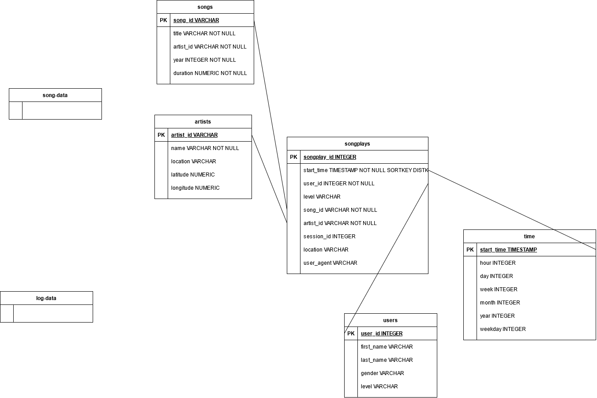

# Cloud Data Lakes With AWS EMR - Apache Spark

## Summary

The demo project conducts ETL operations on JSON files from a data lake and processes data with Apache Spark.   

The first step is to load data from data lake AWS S3 into Apache Spark. 
The second step processes the data resources and writes results back to S3. Results are five tables that model a star schema.

## Data
The data sets consists of two datasets of files, that are provided in AWS S3 data lakes:

- Song dataset (available at `s3://udacity-dend/song_data`) contains JSON files, like  

        {
        "num_songs": 1, 
        "artist_id": "AR8ZCNI1187B9A069B", 
        "artist_latitude": null, 
        "artist_longitude": null, 
        "artist_location": "", 
        "artist_name": "Planet P Project", 
        "song_id": "SOIAZJW12AB01853F1", 
        "title": "Pink World", 
        "duration": 269.81832, 
        "year": 1984
        }
  
- Log dataset (available at `s3://udacity-dend/log_data`) contains JSON files, like
  
        {
        "artist":"N.E.R.D. FEATURING MALICE",
        "auth":"Logged In",
        "firstName":"Jayden",				
        "gender":"M",						
        "itemInSession":0,
        "lastName":"Fox",					
        "length":288.9922,					
        "level":"free",							
        "location":"New Orleans-Metairie, LA",	
        "method":"PUT",				
        "page":"NextSong",
        "registration":1541033612796.0,
        "sessionId":184,
        "song":"Am I High (Feat. Malice)",		
        "status":200,
        "ts":1541121934796,						
        "userAgent":"\"Mozilla\/5.0 (Windows NT 6.3; WOW64) AppleWebKit\/537.36 (KHTML, like Gecko) Chrome\/36.0.1985.143 Safari\/537.36\"", '-> user_table
        "userId":"101" 
        }

## Data Models

The data from both sources is extracted and transformed to five tables that build a star schema. 
This schema consists of the following tables: "songplays" as the fact table and "artist", "songs", "times", and "users" as dimensional tables.
The following diagram shows the tables, and corresponding fields and attributes.

## Prerequisites

The project requires a *Python 3.7* environment, Pyspark 2.4.3., and JAVA8-JDK (or higher). 

To load data from AWS S3, AWS CLI is required, or use the zip files provided in GitHub project. 

To access AWS S3 and to process data with AWS EMR, the config-file dl.cfg in sections [AWS] contains the access information. Use dl_example.cfg as template.
The mandatory arguments are:
  
    [AWS]  
    AWS_ACCESS_KEY_ID = <Access KEY without quotes>  
    AWS_SECRET_ACCESS_KEY = <Access SECRET without quotes>
    region=us-east-1
    output=json

## Getting Started

A running PySpark / Python environment is assumed.  

AWS S3 provides both datasets as a data lake. It is recommended to preload data to a local directory data/ within the Python environment. That speeds up the load process. 

First, connect to the S3 and load data to directory:  

    cd <path to project>
    mkdir data
    cd data

Either extract data/log-data.zip and data/song-data.zip that are provided by this GitHub project in new subfolders (log-data/ or song-data/)

    unzip log-data.zip -d log-data
    unzip song-data.zip

The zip file song-data contains the directory song_data, so rename directory `mkdir song_data, log-data`.

  or copy raw data from AWS S3 in new subfolders (log-data/ or song-data/):

    aws s3 cp s3://udacity-dend/log_data log-data --recursive
    aws s3 cp s3://udacity-dend/song_data song-data --recursive

If files were collected, set the data input and data output path in etl.py, (Project path is equivalent to os.getcwd()):

    input_data = os.path.join(os.getcwd(), "data")  # Alternative: input_data = "s3a://udacity-dend/"
    output_data = os.path.join(os.getcwd(), "data")  # Alternative: output_data = "s3a://<S3 bucket name>/data/"

Second, execute the ETL operations and load the data into the five tables that represent the star schema:  

    python etl.py

Within the ETL step, the resulting tables are persisted in S3. This ETL process could be deployed in an AWS EMR cluster.